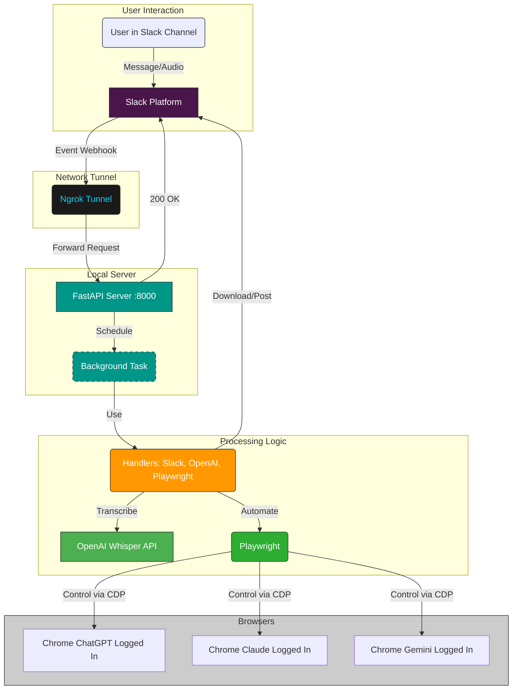

# AI Chorus: A chorus for your yapping

A locally running application that listens to Slack messages (including audio), transcribes them, and submits the text to ChatGPT, Claude, and Gemini web UIs using Playwright. Posts back links and screenshots to Slack.

<p float="left">
  
  
</p>

## Table of Contents

*   [Overview](#overview)
*   [Architecture](#architecture)
*   [Prerequisites](#prerequisites)
*   [Setup](#setup)
*   [Running the Application](#running-the-application)
*   [Configuration](#configuration)
*   [Usage](#usage)
*   [Troubleshooting](#troubleshooting)
*   [License](#license)

## Overview

This tool automates sending prompts (from Slack text or transcribed audio) to multiple AI web apps simultaneously, overcoming the tedious copy-pasting process. It runs locally, interacting with browser instances where you are already logged in.

**Core Features:**
*   Slack message/audio listener.
*   OpenAI Whisper transcription.
*   Playwright automation for ChatGPT, Claude, Gemini web UIs.
*   Returns permalinks and screenshots to Slack thread.

## Architecture

The system uses a local FastAPI server exposed via ngrok, processing Slack events asynchronously.



**Key Components:** FastAPI, Uvicorn, Playwright, OpenAI API, Slack SDK, Ngrok, `uv`.

## Prerequisites

*   Python 3.11+
*   `uv` ([Installation Guide](https://github.com/astral-sh/uv#installation))
*   Git
*   Google Chrome (or Chromium)
*   ngrok (with `ngrok config add-authtoken <your_token>`)
*   **Accounts & Keys:** Slack Bot Token/Secret, OpenAI API Key, Logged-in accounts for ChatGPT, Claude, Gemini.

## Setup

1.  **Clone:** `git clone <your-repo-url> && cd <repo-dir>`
2.  **Env:** `uv venv --python 3.11 .venv && source .venv/bin/activate` (or Windows equivalent)
3.  **Deps:** `uv pip install -r requirements.txt`
4.  **Browsers:** `playwright install --with-deps chromium`
5.  **`.env` File:** Create `.env` in the root (add to `.gitignore`). Populate with:
    ```dotenv
    SLACK_BOT_TOKEN=xoxb-...
    SLACK_SIGNING_SECRET=...
    OPENAI_API_KEY=sk-...
    # Ensure ports are unique and available
    CHROME_DEBUG_PORT_CHATGPT=9222
    CHROME_DEBUG_PORT_CLAUDE=9223
    CHROME_DEBUG_PORT_GEMINI=9224
    # TARGET_SLACK_CHANNEL_ID=C... (Optional)
    ```

## Running the Application

This requires multiple persistent processes.

**1. Launch AI Browser Instances:**

Use the provided script to launch **separate, logged-in Chrome instances** for each service with remote debugging enabled. The script handles copying your default Chrome profile (`Profile 3` assumed) to a temporary location for isolation.

*   Open **three separate terminals**.
*   In terminal 1, run:
    ```bash
    ./start_ai_browsers.sh chatgpt
    ```
*   In terminal 2, run:
    ```bash
    ./start_ai_browsers.sh claude
    ```
*   In terminal 3, run:
    ```bash
    ./start_ai_browsers.sh gemini
    ```
*   **Manual Login:** The *first time* you run this (or if you clear profiles), you **must manually log in** to `chat.openai.com`, `claude.ai`, and `gemini.google.com` in the respective browser windows that appear. The `--user-data-dir` used by the script will persist these logins for future runs.
*   **Keep these terminals/browsers running.**

*(Note: Ensure the paths `SOURCE_USER_DATA_DIR` and `BACKUP_BASE_DIR` in `start_ai_browsers.sh` are correct for your system if they differ from the defaults.)*

**2. Start the FastAPI Server:**

*   Open a **new** terminal.
*   Activate the virtual environment: `source .venv/bin/activate`
*   Start the server:
    ```bash
    uvicorn app.main:app --reload --port 8000
    ```
*   Keep this terminal running. Watch for logs confirming connection to the debug ports.

**3. Start ngrok:**

*   Open **another** terminal.
*   Expose port 8000:
    ```bash
    ngrok http 8000
    ```
*   **Copy the HTTPS URL** provided by ngrok (e.g., `https://<random-string>.ngrok-free.app`).

**4. Configure Slack:**

*   Go to your Slack App -> Event Subscriptions.
*   Paste the ngrok HTTPS URL + `/slack/events` into the "Request URL" field (e.g., `https://<random-string>.ngrok-free.app/slack/events`). Wait for verification.
*   Ensure the `message.channels` bot event is subscribed.
*   Save changes and reinstall the app if needed.

## Configuration

Key `.env` variables:
*   `SLACK_BOT_TOKEN`, `SLACK_SIGNING_SECRET`
*   `OPENAI_API_KEY`
*   `CHROME_DEBUG_PORT_CHATGPT`, `_CLAUDE`, `_GEMINI` (Must match ports used in step 1)
*   `TARGET_SLACK_CHANNEL_ID` (Optional: Restrict bot to one channel)

## Usage

1.  Invite the bot to a desired public channel (or the `TARGET_SLACK_CHANNEL_ID`).
2.  Send a message with text **or** an audio file attachment.
3.  Wait for the bot to reply in a thread with results (links, transcript snippet, errors) and uploaded screenshots.

## Troubleshooting

*   **Playwright Connection Errors:** Ensure Chrome instances were started with `./start_ai_browsers.sh <service>` *before* the FastAPI server. Check `.env` ports match script ports. Check server logs on startup.
*   **Slack Verification Fails:** Check ngrok is running and points to port 8000. Check FastAPI is running. Check Request URL in Slack ends with `/slack/events`.
*   **AI Submissions Fail:** Web UIs change! Selectors in `app/playwright_handler.py` may need updating. Use browser dev tools on the *specific instance launched by the script* to find new selectors.
*   **Transcription Fails:** Check `OPENAI_API_KEY` and account status.
*   **Script Errors (`start_ai_browsers.sh`):** Verify paths (`SOURCE_USER_DATA_DIR`, `BACKUP_BASE_DIR`, Chrome executable location within the script if needed) and profile name (`Profile 3`) match your system.

