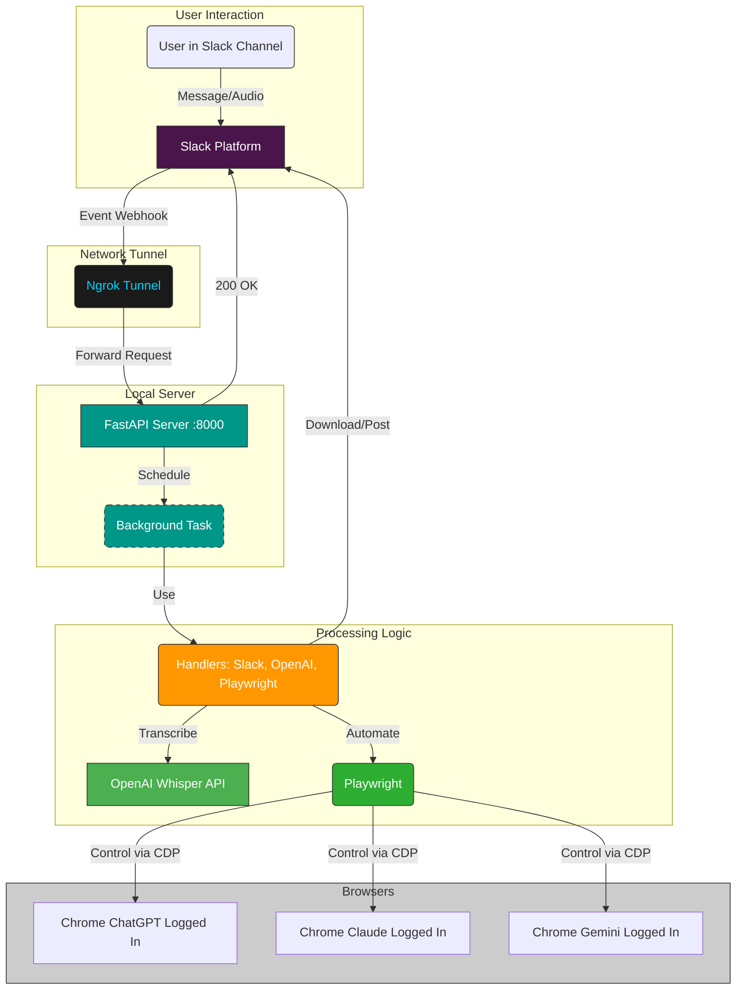

# AI Chorus: Yap across all your AI Apps

Do YOU pay for multiple AI apps?
Do YOU yap to these apps throughout the day?
Do YOU wish to maximize your value-for-money across these apps? 
AI Chorus is for YOU.

A locally running application that listens to Slack messages (including audio), transcribes them, and submits the text to ChatGPT, Claude, and Gemini web UIs using Playwright. Posts back links and screenshots to Slack.

<p float="left">
  
  
</p>

## Table of Contents

*   [Overview](#overview)
*   [Architecture](#architecture)
*   [Prerequisites](#prerequisites)
*   [Setup](#setup)
*   [Running the Application](#running-the-application)
*   [Configuration](#configuration)
*   [Usage](#usage)
*   [Troubleshooting](#troubleshooting)
*   [License](#license)

## Overview

This tool automates sending prompts (from Slack text or transcribed audio) to multiple AI web apps simultaneously, overcoming the tedious copy-pasting process. It runs locally, interacting with browser instances where you are already logged in.

**Core Features:**
*   Slack message/audio listener.
*   OpenAI Whisper transcription.
*   Playwright automation for ChatGPT, Claude, Gemini web UIs.
*   Returns permalinks and screenshots to Slack thread.

## Architecture

The system uses a local FastAPI server exposed via ngrok, processing Slack events asynchronously.



**Key Components:** FastAPI, Uvicorn, Playwright, OpenAI API, Slack SDK, Ngrok, `uv`.

## Prerequisites

*   Python 3.11+
*   `uv` ([Installation Guide](https://github.com/astral-sh/uv#installation))
*   Git
*   Google Chrome (or Chromium)
*   ngrok (with `ngrok config add-authtoken <your_token>`)
*   **Accounts & Keys:** Slack Bot Token/Secret, OpenAI API Key, Logged-in accounts for ChatGPT, Claude, Gemini.

## Setup

1.  **Clone:** `git clone <your-repo-url> && cd <repo-dir>`
2.  **Env:** `uv venv --python 3.11 .venv && source .venv/bin/activate` (or Windows equivalent)
3.  **Deps:** `uv pip install -r requirements.txt`
4.  **Browsers:** `playwright install --with-deps chromium`
5.  **`.env` File:** Create `.env` in the root (add to `.gitignore`). Populate with:
    ```dotenv
    SLACK_BOT_TOKEN=xoxb-...
    SLACK_SIGNING_SECRET=...
    OPENAI_API_KEY=sk-...
    # Ensure ports are unique and available
    CHROME_DEBUG_PORT_CHATGPT=9222
    CHROME_DEBUG_PORT_CLAUDE=9223
    CHROME_DEBUG_PORT_GEMINI=9224
    ```

6.  **Configure Slack Event Subscription:**
    * Run `ngrok http 8000` temporarily in a separate terminal to get a public URL (e.g., `https://<random-string>.ngrok-free.app`). 
    * Use the url for the following manifest and create a Slack App
        ```json
        {
            "display_information": {
                "name": "ChorusAI"
            },
            "features": {
                "bot_user": {
                    "display_name": "ChorusAI",
                    "always_online": false
                }
            },
            "oauth_config": {
                "scopes": {
                    "bot": [
                        "app_mentions:read",
                        "channels:history",
                        "chat:write",
                        "files:read",
                        "files:write",
                        "remote_files:write"
                    ]
                }
            },
            "settings": {
                "event_subscriptions": {
                    "request_url": "https://YOUR_NGROK/slack/events",
                    "bot_events": [
                        "message.channels"
                    ]
                },
                "org_deploy_enabled": false,
                "socket_mode_enabled": false,
                "token_rotation_enabled": false
            }
        }
        ```

## Running the Application

This involves a one-time browser profile setup and then the regular process of launching the script, server, and tunnel.

**1. Initial Browser Profile Setup (One-Time Only):**

This step ensures the application can interact with browser instances where you are already logged into the necessary AI services.

*   **Create a Dedicated Chrome Profile:**
    *   Open Google Chrome normally.
    *   Click the profile icon (usually top-right) -> Add -> Continue without an account.
    *   Give the profile a distinct name (e.g., "AI Chorus Apps") and customize if desired.
*   **Log In to AI Services:**
    *   Using **only this new Chrome profile**, navigate to and log in to:
        *   `https://chat.openai.com`
        *   `https://claude.ai`
        *   `https://gemini.google.com`
    *   Ensure you are fully logged in and past any introductory screens.
*   **Identify Profile Path:**
    *   You need the main Chrome user data directory and the specific profile folder name for the profile you just created.
    *   Navigate to `chrome://version` in your **new** Chrome profile.
    *   Find the **"Profile Path"**. It will look something like:
        *   macOS: `/Users/<your_username>/Library/Application Support/Google/Chrome/Profile X`
        *   Windows: `C:\Users\<your_username>\AppData\Local\Google\Chrome\User Data\Profile X`
        *   Linux: `/home/<your_username>/.config/google-chrome/Profile X`
    *   Note down:
        *   The **User Data Directory** (the part *before* `/Profile X`, e.g., `/Users/<your_username>/Library/Application Support/Google/Chrome`).
        *   The **Profile Name** (the directory name itself, e.g., `Profile 3`, `Profile 1`, or the name you gave it if it appears like `Default`).
*   **Configure `start_ai_browsers.sh`:**
    *   Open the `start_ai_browsers.sh` script in a text editor.
    *   Update the `SOURCE_USER_DATA_DIR` variable to match the **User Data Directory** you found.
    *   Update the `PROFILE_NAME` variable to match the **Profile Name** directory you found.
    *   *Optional:* Adjust the `BACKUP_BASE_DIR` if you want the temporary profile copies stored elsewhere.
    *   Save the script.

**2. Launching the Application (Each Time You Run It):**

This requires multiple persistent processes.

*   **A. Launch AI Browser Instances:**
    *   Use the configured `start_ai_browsers.sh` script.
    *   Run in terminal: `cd <project_dir> && ./start_ai_browsers.sh chatgpt`
    *   Run in terminal: `cd <project_dir> && ./start_ai_browsers.sh claude`
    *   Run in terminal: `cd <project_dir> && ./start_ai_browsers.sh gemini`
    *   These will take a few seconds since it's copying the chrome user data directory.
    *   This will create temporary copies of your configured profile and launch separate Chrome instances for each service, connecting them to the debug ports defined in your `.env` file.
    *   **Keep these terminals/browsers running.**
*   **B. Start the FastAPI Server:**
    *   Open a **new** terminal.
    *   Navigate to the project directory: `cd <project_dir>`
    *   Activate the virtual environment: `source .venv/bin/activate`
    *   Start the server: `uvicorn app.main:app --reload --port 8000`
    *   Keep this terminal running. Watch for logs confirming connection to the debug ports.
    
**3. Ready!**

Your local server is running, connected to your logged-in browser instances, and accessible to Slack via ngrok. You can now proceed to [Usage](#usage).

## Configuration

Key `.env` variables:
*   `SLACK_BOT_TOKEN`, `SLACK_SIGNING_SECRET`
*   `OPENAI_API_KEY`
*   `CHROME_DEBUG_PORT_CHATGPT`, `_CLAUDE`, `_GEMINI` (Must match ports used in step 1)

## Usage

1.  Invite the bot to a desired public channel.
2.  Send a message with text **or** an audio file attachment.
3.  Wait for the bot to reply in a thread with results (links, transcript snippet, errors) and uploaded screenshots.

## Troubleshooting

*   **Playwright Connection Errors:** Ensure Chrome instances were started with `./start_ai_browsers.sh <service>` *before* the FastAPI server. Check `.env` ports match script ports. Check server logs on startup.
*   **Slack Verification Fails:** Check ngrok is running and points to port 8000. Check FastAPI is running. Check Request URL in Slack ends with `/slack/events`.
*   **AI Submissions Fail:** Web UIs change! Selectors in `app/playwright_handler.py` may need updating. Use browser dev tools on the *specific instance launched by the script* to find new selectors.
*   **Transcription Fails:** Check `OPENAI_API_KEY` and account status.
*   **Script Errors (`start_ai_browsers.sh`):** Verify paths (`SOURCE_USER_DATA_DIR`, `BACKUP_BASE_DIR`, Chrome executable location within the script if needed) and profile name (`Profile 3`) match your system.

